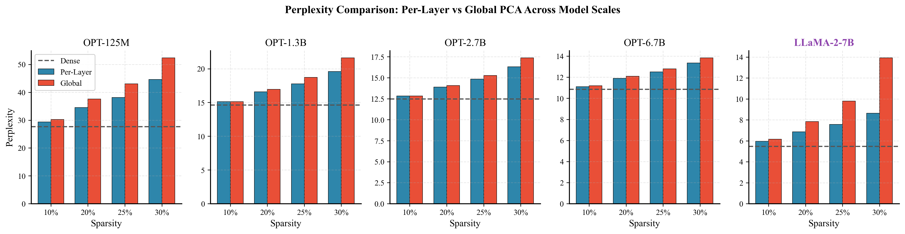
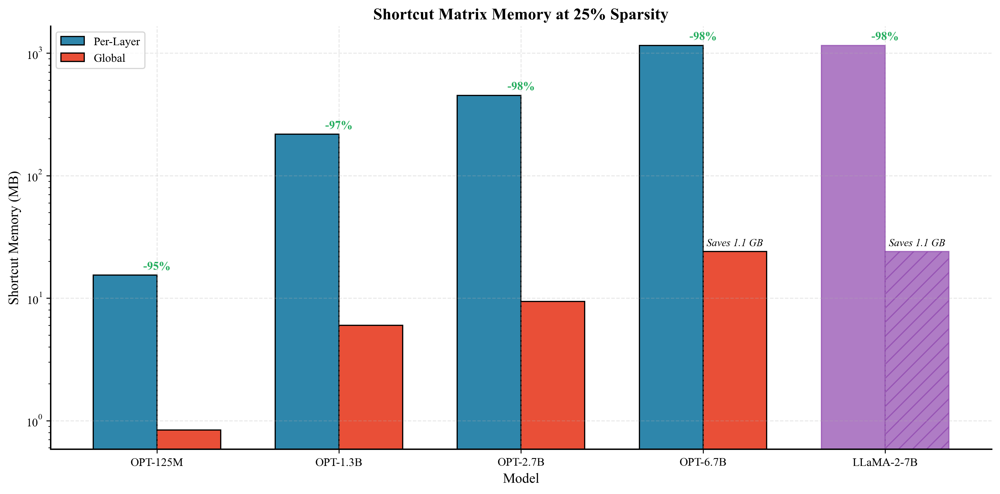

# SliceGPT with Global PCA Extension

> **This is a fork of [microsoft/TransformerCompression](https://github.com/microsoft/TransformerCompression)**

## Technical Note

**A concise technical write-up summarizing the experiments in this repository:**

**[Global PCA Microstudy (PDF)](docs/global_pca_microstudy_v2.pdf)**

This document describes the experimental setup, implementation details, and empirical results for global and K-block PCA rotations in SliceGPT.

---

This repository extends SliceGPT with **Global PCA rotation**, an alternative to per-layer PCA that uses a single rotation matrix for all transformer layers. This achieves significant memory savings with minimal perplexity impact.

## What's New

### Global PCA Rotation

Instead of computing a separate rotation matrix Q for each layer (per-layer PCA), Global PCA computes **one rotation matrix from all layer activations** and applies it uniformly.

**Benefits:**
- **97% reduction** in shortcut matrix memory (e.g., 1.1 GB → 30 MB for OPT-6.7B)
- **2× faster** compression time (single eigendecomposition vs. one per layer)
- **Only ~10% higher perplexity** compared to per-layer PCA

### Key Results

| Model | Per-Layer PPL | Global PPL | Δ PPL | Memory Saved |
|-------|---------------|------------|-------|--------------|
| OPT-125M | 39.60 | 44.31 | +12% | 14.5 MB |
| OPT-1.3B | 17.93 | 19.92 | +11% | 211.5 MB |
| OPT-6.7B | 12.31 | 13.53 | +10% | 1,134 MB |
| LLaMA-7B | 6.24 | 6.79 | +9% | - |





---

## Quick Start

### Running Global PCA SliceGPT

```bash
python experiments/run_slicegpt_global.py \
    --model facebook/opt-125m \
    --sparsity 0.25 \
    --use-global-pca \
    --device cuda:0 \
    --no-wandb
```

### Standard Per-Layer SliceGPT (original)

```bash
python experiments/run_slicegpt.py \
    --model facebook/opt-125m \
    --sparsity 0.25 \
    --device cuda:0 \
    --no-wandb
```

---

## New Functions

The following functions were added to `src/slicegpt/rotate.py`:

| Function | Description |
|----------|-------------|
| `rotate_and_slice_global_pca()` | Single rotation matrix for all layers |
| `rotate_and_slice_kblock()` | K-block hybrid (experimental) |
| `collect_global_covariance()` | Aggregates covariance across all layers |

---

## K-Block Study (Negative Result)

We also investigated **K-block rotation**: grouping layers into K blocks, each with a shared rotation matrix. This was expected to provide a middle ground between per-layer and global PCA.

**Finding:** K-block rotation fails catastrophically for intermediate K values due to information loss at block boundaries. Only K=1 (per-layer) and K=L (global) are practical.

| K | Perplexity |
|---|------------|
| 1 (per-layer) | 39.60 |
| 2 | 1942 ❌ |
| 4 | 300 ❌ |
| 12 (global) | 44.31 ✓ |

See [`experiments/KBLOCK_DESIGN.md`](experiments/KBLOCK_DESIGN.md) for full analysis.

---

## Experiment Results

All experimental results are in the `results/` folder:

| Study | Description |
|-------|-------------|
| `global_pca_study/` | Global vs per-layer PCA comparison |
| `calibration_study/` | Effect of calibration samples on perplexity |
| `throughput_study/` | Inference speed and memory benchmarks |
| `llama_study/` | Results on LLaMA-7B |
| `kblock_full_study/` | K-block ablation (negative result) |

---

## Installation

```bash
pip install -e .[experiment]
```

For fine-tuning support:
```bash
pip install -e .[experiment,finetune]
```

---

## Supported Models

Same as original SliceGPT:
- OPT family (125M to 66B)
- LLaMA-2/3 family
- Phi-2, Phi-3

---

## Citation

If you use this work, please cite the original SliceGPT paper:

```bibtex
@inproceedings{ashkboos2024slicegpt,
  title={SliceGPT: Compress Large Language Models by Deleting Rows and Columns},
  author={Ashkboos, Saleh and others},
  booktitle={ICLR},
  year={2024}
}
```

---

## License

MIT License (inherited from original repository)

## Acknowledgments

This work builds on [SliceGPT](https://arxiv.org/abs/2401.15024) by Microsoft Research.
